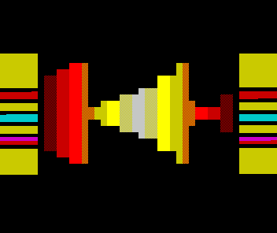

# Brainwasher
256 bytes intro for ZX Spectrum
## Tech Infos
* ZX Spectrum 48
* Z80 Assembler ( executable size <= 256 bytes )
## Screenshot

## Build instruction
* Use Pasmo to build

## Authors
* **Tomasz Słanina** - [dox](https://github.com/tslanina)
## License
This project is licensed under the GPL v3 License - see the [LICENSE](LICENSE) file for details
